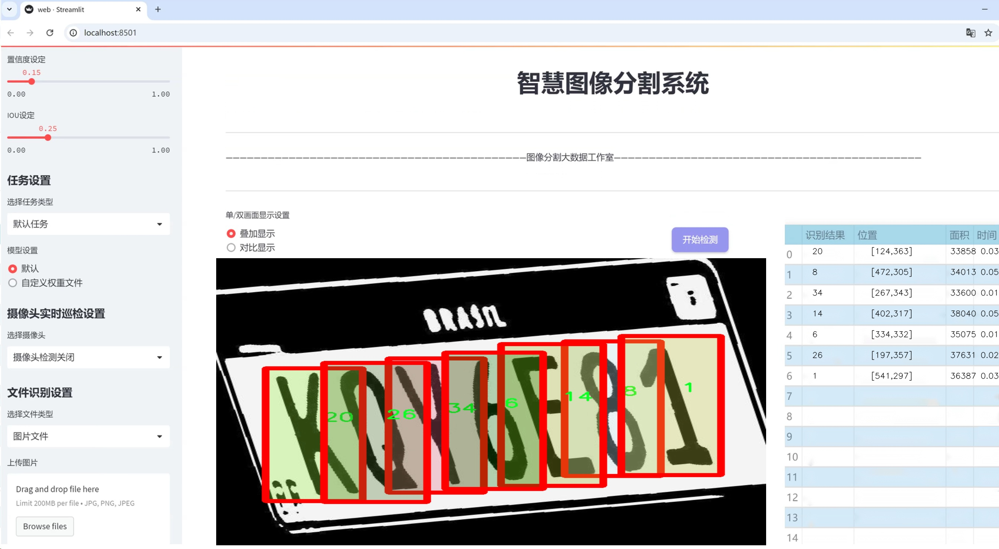
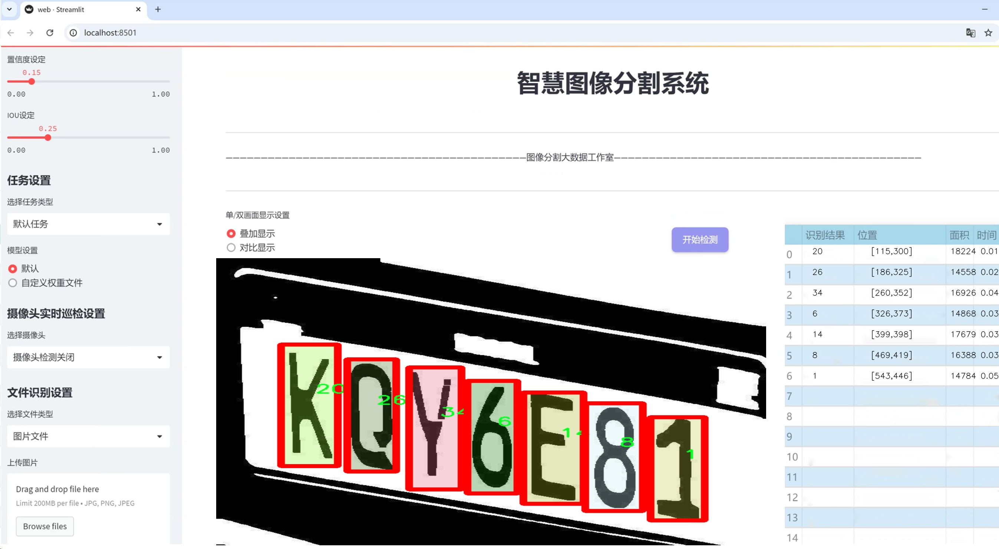
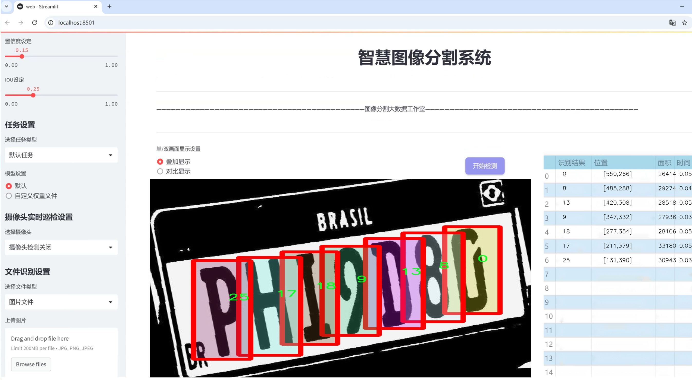
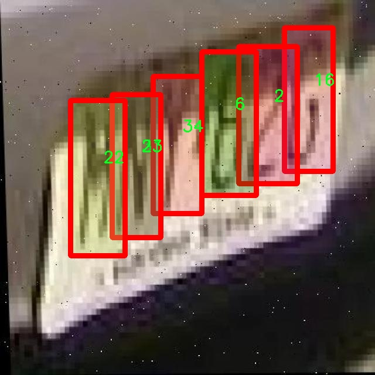
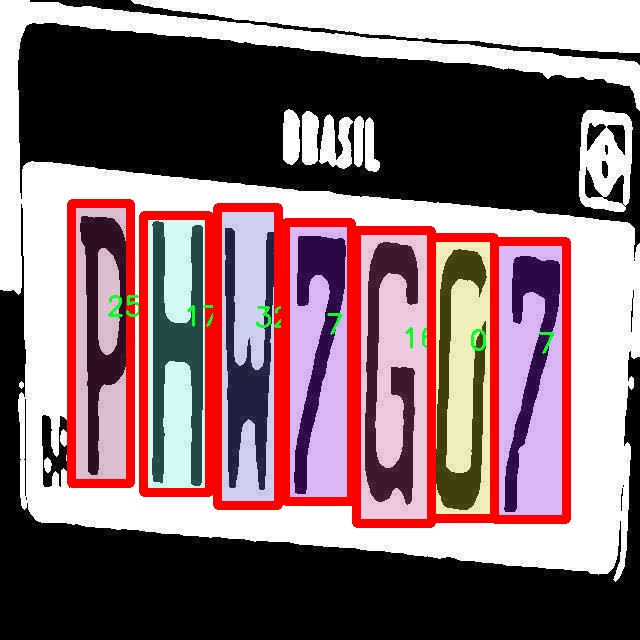
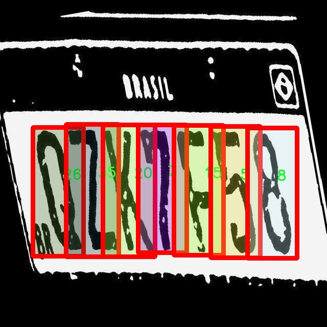
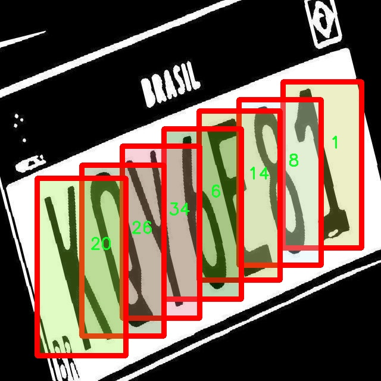
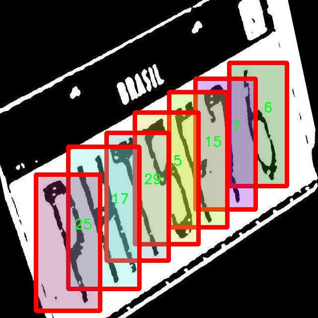

# 车牌字符分割系统源码＆数据集分享
 [yolov8-seg-C2f-DySnakeConv＆yolov8-seg-FocalModulation等50+全套改进创新点发刊_一键训练教程_Web前端展示]

### 1.研究背景与意义

项目参考[ILSVRC ImageNet Large Scale Visual Recognition Challenge](https://gitee.com/YOLOv8_YOLOv11_Segmentation_Studio/projects)

项目来源[AAAI Global Al lnnovation Contest](https://kdocs.cn/l/cszuIiCKVNis)

研究背景与意义

随着智能交通系统的快速发展，车牌识别技术在交通管理、智能停车、自动收费等领域的应用愈发广泛。车牌作为车辆身份的唯一标识，其信息的准确获取和处理对于提升交通管理效率、保障公共安全具有重要意义。然而，传统的车牌识别方法在复杂环境下（如光照变化、遮挡、污损等）往往面临识别率低、处理速度慢等问题。因此，开发一种高效、准确的车牌字符分割系统显得尤为重要。

近年来，深度学习技术的迅猛发展为图像处理领域带来了新的机遇。YOLO（You Only Look Once）系列模型因其高效的实时检测能力而受到广泛关注。YOLOv8作为该系列的最新版本，结合了多种先进的计算机视觉技术，展现出更强的特征提取能力和更高的检测精度。通过对YOLOv8进行改进，构建一个专门针对车牌字符分割的系统，将有助于提高车牌识别的准确性和实时性。

本研究基于改进YOLOv8的车牌字符分割系统，利用一个包含9700张图像和36个类别的车牌数据集进行训练和验证。该数据集的丰富性和多样性为模型的学习提供了坚实的基础，涵盖了不同类型、不同环境下的车牌图像，能够有效提升模型的泛化能力。通过对车牌字符进行精确分割，系统能够在复杂背景下快速识别出车牌信息，进而为后续的字符识别提供可靠的数据支持。

在研究过程中，我们将重点关注模型的改进策略，包括特征提取网络的优化、损失函数的调整以及数据增强技术的应用等。这些改进不仅能够提升模型的分割精度，还能有效降低计算资源的消耗，满足实时应用的需求。此外，针对车牌字符的多样性和复杂性，我们将设计一套有效的评估指标，以全面评估模型在不同场景下的表现。

本研究的意义在于，不仅为车牌识别技术的发展提供了新的思路和方法，也为智能交通系统的进一步完善奠定了基础。通过提高车牌字符分割的准确性和效率，能够为交通管理部门提供更为精准的数据支持，进而提升交通管理的智能化水平。同时，研究成果也将为相关领域的研究者提供有价值的参考，推动车牌识别技术的进一步发展和应用。

综上所述，基于改进YOLOv8的车牌字符分割系统的研究，不仅具有重要的理论价值，也具备广泛的实际应用前景。通过深入探索和优化车牌字符分割技术，我们期待能够为智能交通的未来发展贡献一份力量。

### 2.图片演示







##### 注意：由于此博客编辑较早，上面“2.图片演示”和“3.视频演示”展示的系统图片或者视频可能为老版本，新版本在老版本的基础上升级如下：（实际效果以升级的新版本为准）

  （1）适配了YOLOV8的“目标检测”模型和“实例分割”模型，通过加载相应的权重（.pt）文件即可自适应加载模型。

  （2）支持“图片识别”、“视频识别”、“摄像头实时识别”三种识别模式。

  （3）支持“图片识别”、“视频识别”、“摄像头实时识别”三种识别结果保存导出，解决手动导出（容易卡顿出现爆内存）存在的问题，识别完自动保存结果并导出到tempDir中。

  （4）支持Web前端系统中的标题、背景图等自定义修改，后面提供修改教程。

  另外本项目提供训练的数据集和训练教程,暂不提供权重文件（best.pt）,需要您按照教程进行训练后实现图片演示和Web前端界面演示的效果。

### 3.视频演示

[3.1 视频演示](https://www.bilibili.com/video/BV1g9x9eoEuf/)

### 4.数据集信息展示

##### 4.1 本项目数据集详细数据（类别数＆类别名）

nc: 36
names: ['0', '1', '10', '11', '12', '13', '14', '15', '16', '17', '18', '19', '2', '20', '21', '22', '23', '24', '25', '26', '27', '28', '29', '3', '30', '31', '32', '33', '34', '35', '4', '5', '6', '7', '8', '9']


##### 4.2 本项目数据集信息介绍

数据集信息展示

在本研究中，我们采用了名为“Car Plate ocr”的数据集，以训练和改进YOLOv8-seg模型，旨在实现高效的车牌字符分割系统。该数据集的设计专注于车牌字符的识别与分割，涵盖了36个不同的类别，这些类别具体包括数字0至9以及10至35的组合，形成了一个完整的字符集。这种多样化的类别设置为模型的训练提供了丰富的样本，确保了其在实际应用中的准确性和鲁棒性。

“Car Plate ocr”数据集中的类别列表为：['0', '1', '10', '11', '12', '13', '14', '15', '16', '17', '18', '19', '2', '20', '21', '22', '23', '24', '25', '26', '27', '28', '29', '3', '30', '31', '32', '33', '34', '35', '4', '5', '6', '7', '8', '9']。这一系列的字符涵盖了车牌上可能出现的所有数字，能够有效支持多种车牌格式的识别需求。

在数据集的构建过程中，研究团队精心挑选了各种不同环境下的车牌图像，确保数据集的多样性和代表性。这些图像不仅包括不同国家和地区的车牌样式，还涵盖了不同的拍摄角度、光照条件以及背景干扰。这种多样性使得模型在训练过程中能够学习到更为复杂的特征，从而提升其在真实场景中的表现。

此外，数据集中的每一张图像都经过精确的标注，确保了字符的分割区域与实际字符位置的高度一致。这种高质量的标注对于训练深度学习模型至关重要，因为它直接影响到模型的学习效果和最终的识别精度。通过使用“Car Plate ocr”数据集，YOLOv8-seg模型能够在字符分割任务中实现更高的准确率，进而提升车牌识别系统的整体性能。

在训练过程中，我们将数据集分为训练集和验证集，以便于模型的调优和性能评估。训练集用于模型的学习，而验证集则用于监测模型在未见数据上的表现，确保其泛化能力。通过不断调整模型参数和优化算法，我们期望在字符分割的精度和速度上取得显著提升。

总之，“Car Plate ocr”数据集为本研究提供了坚实的基础，支持我们在车牌字符分割领域的探索与创新。通过对该数据集的深入分析与应用，我们希望能够推动车牌识别技术的发展，满足日益增长的智能交通和自动化管理需求。随着研究的深入，我们相信这一数据集将为未来的相关研究提供宝贵的参考和借鉴。











### 5.全套项目环境部署视频教程（零基础手把手教学）

[5.1 环境部署教程链接（零基础手把手教学）](https://www.bilibili.com/video/BV1jG4Ve4E9t/?vd_source=bc9aec86d164b67a7004b996143742dc)


[5.2 安装Python虚拟环境创建和依赖库安装视频教程链接（零基础手把手教学）](https://www.bilibili.com/video/BV1nA4VeYEze/?vd_source=bc9aec86d164b67a7004b996143742dc)

### 6.手把手YOLOV8-seg训练视频教程（零基础小白有手就能学会）

[6.1 手把手YOLOV8-seg训练视频教程（零基础小白有手就能学会）](https://www.bilibili.com/video/BV1cA4VeYETe/?vd_source=bc9aec86d164b67a7004b996143742dc)


按照上面的训练视频教程链接加载项目提供的数据集，运行train.py即可开始训练



     Epoch   gpu_mem       box       obj       cls    labels  img_size
     1/200     0G   0.01576   0.01955  0.007536        22      1280: 100%|██████████| 849/849 [14:42<00:00,  1.04s/it]
               Class     Images     Labels          P          R     mAP@.5 mAP@.5:.95: 100%|██████████| 213/213 [01:14<00:00,  2.87it/s]
                 all       3395      17314      0.994      0.957      0.0957      0.0843

     Epoch   gpu_mem       box       obj       cls    labels  img_size
     2/200     0G   0.01578   0.01923  0.007006        22      1280: 100%|██████████| 849/849 [14:44<00:00,  1.04s/it]
               Class     Images     Labels          P          R     mAP@.5 mAP@.5:.95: 100%|██████████| 213/213 [01:12<00:00,  2.95it/s]
                 all       3395      17314      0.996      0.956      0.0957      0.0845

     Epoch   gpu_mem       box       obj       cls    labels  img_size
     3/200     0G   0.01561    0.0191  0.006895        27      1280: 100%|██████████| 849/849 [10:56<00:00,  1.29it/s]
               Class     Images     Labels          P          R     mAP@.5 mAP@.5:.95: 100%|███████   | 187/213 [00:52<00:00,  4.04it/s]
                 all       3395      17314      0.996      0.957      0.0957      0.0845


### 7.50+种全套YOLOV8-seg创新点代码加载调参视频教程（一键加载写好的改进模型的配置文件）

[7.1 50+种全套YOLOV8-seg创新点代码加载调参视频教程（一键加载写好的改进模型的配置文件）](https://www.bilibili.com/video/BV1Hw4VePEXv/?vd_source=bc9aec86d164b67a7004b996143742dc)

### 8.YOLOV8-seg图像分割算法原理

原始YOLOv8-seg算法原理

YOLOv8-seg算法是YOLO系列目标检测模型的最新版本，结合了目标检测与图像分割的能力，标志着计算机视觉领域的一次重要进步。YOLO（You Only Look Once）系列算法自诞生以来，以其高效的单阶段检测方法而闻名，YOLOv8则在前代模型的基础上进行了多项优化，提升了检测精度和速度。YOLOv8-seg的核心在于其独特的网络结构和创新的处理机制，使其在处理复杂场景时表现出色。

YOLOv8-seg的网络结构主要由四个部分组成：输入层、Backbone骨干网络、Neck特征融合网络和Head检测模块。输入层负责对输入图像进行预处理，包括图像的缩放、裁剪以及数据增强技术，如马赛克增强、混合增强等，以提升模型的鲁棒性和泛化能力。通过这些预处理步骤，YOLOv8-seg能够更好地适应不同场景和物体的变化，从而提高后续特征提取的效果。

在Backbone部分，YOLOv8-seg采用了改进的DarkNet结构，具体而言，YOLOv8将传统的C3模块替换为C2f模块。C2f模块通过引入更多的分支结构，增强了梯度流动，使得特征提取过程更加高效。这种设计不仅保留了轻量级特性，还提高了模型对不同尺度目标的敏感性。C2f模块的多分支结构允许信息在不同层之间更好地流动，从而增强了特征的表达能力。YOLOv8-seg还引入了SPPF模块，通过多种内核尺寸的池化操作，对特征图进行合并，进一步丰富了特征信息。

Neck部分采用了FPN（特征金字塔网络）和PAN（路径聚合网络）的结合结构，这一设计使得不同尺度的特征能够充分融合。FPN负责将高层语义信息与低层细节信息结合，而PAN则通过路径聚合增强了特征的传递能力。通过这种结构，YOLOv8-seg能够有效地处理多尺度目标，提升检测的准确性和稳定性。特征融合的过程不仅仅是简单的特征叠加，而是通过复杂的网络结构实现信息的深度交互，使得模型在面对复杂场景时，能够提取到更具代表性的特征。

在Head检测模块中，YOLOv8-seg采用了解耦头的结构，这一创新设计使得模型能够分别处理分类和定位任务。传统的耦合头结构在进行目标检测时，往往会导致信息的混淆，而解耦头通过两个并行的卷积分支，分别提取类别特征和位置特征，从而提高了模型的检测效率和准确性。这种结构的引入，不仅加速了模型的收敛速度，还使得YOLOv8-seg在处理复杂场景时，能够更好地分辨不同目标的类别和位置。

在标签分配策略方面，YOLOv8-seg采用了动态标签分配策略，避免了传统方法中对候选框的依赖。通过TOOD策略，YOLOv8-seg能够在训练过程中动态调整正负样本的匹配，使得模型在面对不同尺寸和形状的目标时，能够更有效地进行学习。与YOLOv6相似，YOLOv8-seg的损失函数主要包括类别损失和位置损失，其中类别损失采用了Varifocal Loss，位置损失则结合了CIoU Loss与DFL Loss。这种损失函数的设计，旨在通过加权机制，使得模型在训练过程中更加关注高质量的正样本，从而提升整体的检测性能。

YOLOv8-seg的图像分割能力也得益于其独特的网络结构和训练策略。通过对特征图的细致处理，YOLOv8-seg能够在目标检测的同时，生成精确的分割掩码。这一特性使得YOLOv8-seg在诸如自动驾驶、医学影像分析等领域展现出巨大的应用潜力。在实际应用中，YOLOv8-seg不仅能够识别目标，还能够提供目标的精确轮廓，为后续的分析和处理提供了丰富的信息。

综上所述，YOLOv8-seg算法通过对传统YOLO系列的多项改进，尤其是在网络结构、特征融合和损失函数等方面的创新，使得其在目标检测和图像分割任务中表现出色。随着计算机视觉技术的不断发展，YOLOv8-seg无疑将成为推动相关领域进步的重要工具。其高效的处理能力和优越的性能，预示着未来在智能监控、自动驾驶等应用场景中的广泛应用前景。


### 9.系统功能展示（检测对象为举例，实际内容以本项目数据集为准）

图9.1.系统支持检测结果表格显示

  图9.2.系统支持置信度和IOU阈值手动调节

  图9.3.系统支持自定义加载权重文件best.pt(需要你通过步骤5中训练获得)

  图9.4.系统支持摄像头实时识别

  图9.5.系统支持图片识别

  图9.6.系统支持视频识别

  图9.7.系统支持识别结果文件自动保存

  图9.8.系统支持Excel导出检测结果数据


### 10.50+种全套YOLOV8-seg创新点原理讲解（非科班也可以轻松写刊发刊，V11版本正在科研待更新）

#### 10.1 由于篇幅限制，每个创新点的具体原理讲解就不一一展开，具体见下列网址中的创新点对应子项目的技术原理博客网址【Blog】：


[10.1 50+种全套YOLOV8-seg创新点原理讲解链接](https://gitee.com/qunmasj/good)

#### 10.2 部分改进模块原理讲解(完整的改进原理见上图和技术博客链接)

### YOLOv8简介
继YOLOv5之后,Ultralytics公司在2023年1月发布了YOLOv8,该版本可以用于执行目标检测、实例分割和图像分类任务。整个网络结构由4部分组成:输入图像, Backbone主干网络获得图像的特征图, Head检测头预测目标对象和位置, Neck融合不同层的特征并将图像特征传递到预测层。
1)相比于YOLOv5和 YOLOv7算法,YOLOv8在训练时间和检测精度上得到极大提升,而且模型的权重文件只有6 MB,可以部署到任一嵌入式设备中,它凭借自身快速、高效的性能可以很好地满足实时检测的需求。
2)由于YOLOv8算法是YOLOv5的继承版本，对应提供了N、S、 M、L、X 等不同尺度的模型,用于满足不同场景的需求,在精度得到大幅提升的同时,能流畅地训练,并且能安装在各种硬件平台上运行。
3)在输入端,YOLOv8算法使用了Mosaic数据增强[15]、自适应锚框计算[16]等方法。Mosaic数据增强是通过随机缩放、随机裁剪、随机排布的方式进行拼接,丰富检测数据集。自适应锚框计算是网络在初始锚框的基础上输出预测框,通过差值计算、反向更新等操作计算出最佳锚框值。
4)在输出端,YOLOv8算法使用解耦头替换了以往的耦合头,将分类和回归解耦为两个独立的分支,通过解耦使各个任务更加专注,从而解决复杂场景下定位不准及分类错误的问题。


### OREPA：在线卷积重参数化
卷积神经网络(CNNs)已经在许多计算机视觉任务的应用成功，包括图像分类、目标检测、语义分割等。精度和模型效率之间的权衡也已被广泛讨论。

一般来说，一个精度较高的模型通常需要一个更复杂的块，一个更宽或更深的结构。然而，这样的模型总是太重，无法部署，特别是在硬件性能有限、需要实时推理的场景下。考虑到效率，更小、更紧凑和更快的模型自然是首选。

为了获得一个部署友好且高精度的模型，有研究者提出了基于结构重参数化的方法来释放性能。在这些方法中，模型在训练阶段和推理阶段有不同的结构。具体来说，使用复杂的训练阶段拓扑，即重参数化的块，来提高性能。训练结束后，通过等效变换将一个复杂的块重参为成一个单一的线性层。重参后的模型通常具有一个整洁架构模型，例如，通常是一个类似VGG的或一个类似ResNet的结构。从这个角度来看，重参化策略可以在不引入额外的推理时间成本的情况下提高模型的性能。


BN层是重构模型的关键组成部分。在一个重新解析块(图1(b))中，在每个卷积层之后立即添加一个BN层。可以观察到，去除这些BN层会导致的性能退化。然而，当考虑到效率时，这种BN层的使用出乎意料地在训练阶段带来了巨大的计算开销。在推理阶段，复杂的块可以被压缩成一个卷积层。但是，在训练过程中，BN层是非线性的，也就是说，它们将特征映射除以它的标准差，这就阻止了合并整个块。因此，存在大量的中间计算操作(large FLOPS)和缓冲特征映射(high memory usage)。更糟糕的是，这么高的训练预算使得很难探索更复杂和可能更强的重参块。很自然地，下面的问题就出现了：

为什么标准化在重参中这么重要？

通过分析和实验，作者认为BN层中的尺度因子最重要，因为它们能够使不同分支的优化方向多样化。

基于观察结果，作者提出了在线重参化(OREPA)(图1(c))，这是一个两阶段的pipeline，使之能够简化复杂的training-time re-param block。

在第一阶段，block linearization，去除所有的非线性BN层，并引入线性缩放层。这些层与BN层具有相似的性质，因此它们使不同分支的优化多样化。此外，这些层都是线性的，可以在训练过程中合并成卷积层。

第二阶段，block squeezing，将复杂的线性块简化为单一的卷积层。OREPA通过减少由中间计算层引起的计算和存储开销，显著降低了训练成本，对性能只有非常小的影响。

此外，高效化使得探索更复杂的重参化拓扑成为可能。为了验证这一点，作者进一步提出了几个重参化的组件，以获得更好的性能。

在ImageNet分类任务上评估了所提出的OREPA。与最先进的修复模型相比，OREPA将额外的训练时间GPU内存成本降低了65%到75%，并将训练过程加快了1.5-2.3倍。同时，OREPA-ResNet和OREPA-VGG的性能始终优于+0.2%∼+0.6%之前的DBB和RepVGG方法。同时作者还评估了在下游任务上的OREPA，即目标检测和语义分割。作者发现OREPA可以在这些任务上也可以带来性能的提高。

提出了在线卷积重参化(OREPA)策略，这极大地提高了重参化模型的训练效率，并使探索更强的重参化块成为可能；

通过对重参化模型工作机制的分析，用引入的线性尺度层代替BN层，这仍然提供了不同的优化方向，并保持了表示能力;

在各种视觉任务上的实验表明，OREPA在准确性和训练效率方面都优于以前的重参化模型(DBB/RepVGG)。


#### 结构重参化
结构重参化最近被重视并应用于许多计算机视觉任务，如紧凑模型设计、架构搜索和剪枝。重参化意味着不同的架构可以通过参数的等价转换来相互转换。例如，1×1卷积的一个分支和3×3卷积的一个分支，可以转移到3×3卷积的单个分支中。在训练阶段，设计了多分支和多层拓扑来取代普通的线性层(如conv或全连接层)来增强模型。Cao等讨论了如何在训练过程中合并深度可分离卷积核。然后在推理过程中，将训练时间的复杂模型转移到简单模型中，以便于更快的推理。

在受益于复杂的training-time拓扑，同时，当前的重参化方法训练使用不可忽略的额外计算成本。当块变得更复杂以变得更强的表示时，GPU内存利用率和训练时间将会越来越长，最终走向不可接受。与以往的重参化方法不同，本文更多地关注训练成本。提出了一种通用的在线卷积重参化策略，使training-time的结构重参化成为可能。


#### Normalization
BN被提出来缓解训练非常深度神经网络时的梯度消失问题。人们认为BN层是非常重要的，因为它们平滑了损失。最近关于无BN神经网络的研究声称，BN层并不是不可或缺的。通过良好的初始化和适当的正则化，可以优雅地去除BN层。

对于重参化模型，作者认为重参化块中的BN层是关键的。无BN的变体将会出现性能下降。然而，BN层是非线性的，也就是说，它们将特征图除以它的标准差，这阻止了在线合并块。为了使在线重参化可行，作者去掉了重参块中的所有BN层，并引入了BN层的线性替代方法，即线性缩放层。

#### 卷积分解
标准卷积层计算比较密集，导致大的FLOPs和参数量。因此，卷积分解方法被提出，并广泛应用于移动设备的轻量化模型中。重参化方法也可以看作是卷积分解的某种形式，但它更倾向于更复杂的拓扑结构。本文的方法的不同之处在于，在kernel-level上分解卷积，而不是在structure level。

#### 在线重参化
在本节中，首先，分析了关键组件，即重参化模型中的BN层，在此基础上提出了在线重参化(OREPA)，旨在大大减少再参数化模型的训练时间预算。OREPA能够将复杂的训练时间块简化为一个卷积层，并保持了较高的精度。

OREPA的整体pipeline如图所示，它包括一个Block Linearization阶段和一个Block Squeezing阶段。


参考该博客通过分析多层和多分支结构的优化多样性，深入研究了重参化的有效性，并证明了所提出的线性缩放层和BN层具有相似的效果。

最后，随着训练预算的减少，进一步探索了更多的组件，以实现更强的重参化模型，成本略有增加。

#### 重参化中的Normalization
作者认为中间BN层是重参化过程中多层和多分支结构的关键组成部分。以SoTA模型DBB和RepVGG为例，去除这些层会导致严重的性能下降，如表1所示。


这种观察结果也得到了Ding等人的实验支持。因此，作者认为中间的BN层对于重参化模型的性能是必不可少的。

然而，中间BN层的使用带来了更高的训练预算。作者注意到，在推理阶段，重参化块中的所有中间操作都是线性的，因此可以合并成一个卷积层，从而形成一个简单的结构。

但在训练过程中，BN层是非线性的，即它们将特征映射除以其标准差。因此，中间操作应该单独计算，这将导致更高的计算和内存成本。更糟糕的是，如此高的成本将阻止探索更强大的训练模块。

#### Block Linearization
如3.1中所述，中间的BN层阻止了在训练过程中合并单独的层。然而，由于性能问题，直接删除它们并不简单。为了解决这一困境，作者引入了channel级线性尺度操作作为BN的线性替代方法。

缩放层包含一个可学习的向量，它在通道维度中缩放特征映射。线性缩放层具有与BN层相似的效果，它们都促进多分支向不同的方向进行优化，这是重参化时性能提高的关键。除了对性能的影响外，线性缩放层还可以在训练过程中进行合并，使在线重参化成为可能。


基于线性缩放层，作者修改了重参化块，如图所示。具体来说，块的线性化阶段由以下3个步骤组成：

首先，删除了所有的非线性层，即重参化块中的BN层

其次，为了保持优化的多样性，在每个分支的末尾添加了一个缩放层，这是BN的线性替代方法

最后，为了稳定训练过程，在所有分支的添加后添加一个BN层。

一旦完成线性化阶段，在重参化块中只存在线性层，这意味着可以在训练阶段合并块中的所有组件。

#### Block Squeezing
Block Squeezing步骤将计算和内存昂贵的中间特征映射上的操作转换为更经济的kernel上的操作。这意味着在计算和内存方面从减少到，其中、是特征图和卷积核的空间尺寸。

一般来说，无论线性重参化块是多么复杂，以下2个属性始终成立：

Block中的所有线性层，例如深度卷积、平均池化和所提出的线性缩放，都可以用带有相应参数的退化卷积层来表示;

Block可以由一系列并行分支表示，每个分支由一系列卷积层组成。

有了上述两个特性，如果可以将

多层（即顺序结构）

多分支（即并行结构）

简化为单一卷积，就可以压缩一个块。在下面的部分中，将展示如何简化顺序结构(图(a))和并行结构(图(b))。


### 11.项目核心源码讲解（再也不用担心看不懂代码逻辑）

#### 11.1 ui.py

以下是代码的核心部分，并添加了详细的中文注释：

```python
import sys  # 导入sys模块，用于访问与Python解释器紧密相关的变量和函数
import subprocess  # 导入subprocess模块，用于执行外部命令

def run_script(script_path):
    """
    使用当前 Python 环境运行指定的脚本。

    Args:
        script_path (str): 要运行的脚本路径

    Returns:
        None
    """
    # 获取当前 Python 解释器的路径
    python_path = sys.executable

    # 构建运行命令，使用streamlit运行指定的脚本
    command = f'"{python_path}" -m streamlit run "{script_path}"'

    # 执行命令，并等待命令执行完成
    result = subprocess.run(command, shell=True)
    
    # 检查命令执行的返回码，如果不为0，表示执行出错
    if result.returncode != 0:
        print("脚本运行出错。")

# 实例化并运行应用
if __name__ == "__main__":
    # 指定要运行的脚本路径
    script_path = "web.py"  # 假设web.py在当前目录下

    # 调用函数运行脚本
    run_script(script_path)
```

### 代码分析：
1. **导入模块**：
   - `sys`模块用于获取当前Python解释器的路径。
   - `subprocess`模块用于执行外部命令。

2. **`run_script`函数**：
   - 该函数接受一个参数`script_path`，表示要运行的Python脚本的路径。
   - 使用`sys.executable`获取当前Python解释器的路径。
   - 构建一个命令字符串，用于运行`streamlit`命令，`-m`参数表示以模块方式运行。
   - 使用`subprocess.run`执行命令，并等待其完成。
   - 检查返回码，如果返回码不为0，表示脚本运行出错，打印错误信息。

3. **主程序**：
   - 在`__main__`模块中，指定要运行的脚本路径为`web.py`。
   - 调用`run_script`函数，执行指定的脚本。 

这样，代码的核心功能是通过指定的Python环境运行一个Streamlit应用，并处理可能的错误。

这个程序文件 `ui.py` 的主要功能是通过当前的 Python 环境来运行一个指定的脚本，具体是使用 Streamlit 框架来启动一个 Web 应用。代码的结构相对简单，主要包含了几个部分。

首先，文件引入了一些必要的模块，包括 `sys`、`os` 和 `subprocess`。其中，`sys` 模块用于访问与 Python 解释器紧密相关的变量和函数，`os` 模块提供了与操作系统交互的功能，而 `subprocess` 模块则用于创建新进程、连接到它们的输入/输出/错误管道，并获取它们的返回码。

接下来，定义了一个名为 `run_script` 的函数，该函数接受一个参数 `script_path`，表示要运行的脚本的路径。在函数内部，首先获取当前 Python 解释器的路径，这通过 `sys.executable` 实现。然后，构建一个命令字符串，使用 `streamlit run` 命令来运行指定的脚本。这个命令将会在一个新的子进程中执行。

使用 `subprocess.run` 方法来执行构建好的命令，并通过 `shell=True` 参数来允许命令在 shell 中运行。执行后，函数会检查返回码，如果返回码不为零，表示脚本运行出错，则会打印出错误信息。

在文件的最后部分，使用 `if __name__ == "__main__":` 语句来确保当这个文件作为主程序运行时，以下代码才会被执行。这里指定了要运行的脚本路径为 `web.py`，并调用 `run_script` 函数来执行这个脚本。

整体来看，这个文件的功能是通过命令行调用 Streamlit 来启动一个 Web 应用，具体的应用逻辑则在 `web.py` 文件中实现。

#### 11.2 ultralytics\trackers\utils\kalman_filter.py

以下是代码中最核心的部分，并附上详细的中文注释：

```python
import numpy as np
import scipy.linalg

class KalmanFilterXYAH:
    """
    简单的卡尔曼滤波器，用于在图像空间中跟踪边界框。
    状态空间为8维 (x, y, a, h, vx, vy, va, vh)，
    包含边界框中心位置 (x, y)，宽高比 a，高度 h 及其对应的速度。
    物体运动遵循恒定速度模型。
    """

    def __init__(self):
        """初始化卡尔曼滤波器模型矩阵，设置运动和观测的不确定性权重。"""
        ndim, dt = 4, 1.  # 状态维度和时间增量

        # 创建卡尔曼滤波器模型矩阵
        self._motion_mat = np.eye(2 * ndim, 2 * ndim)  # 运动矩阵
        for i in range(ndim):
            self._motion_mat[i, ndim + i] = dt  # 设置速度部分
        self._update_mat = np.eye(ndim, 2 * ndim)  # 更新矩阵

        # 设置运动和观测的不确定性权重
        self._std_weight_position = 1. / 20  # 位置的不确定性权重
        self._std_weight_velocity = 1. / 160  # 速度的不确定性权重

    def initiate(self, measurement):
        """
        从未关联的测量值创建跟踪。

        参数
        ----------
        measurement : ndarray
            边界框坐标 (x, y, a, h)，包含中心位置 (x, y)，宽高比 a 和高度 h。

        返回
        -------
        (ndarray, ndarray)
            返回新的跟踪的均值向量 (8维) 和协方差矩阵 (8x8维)。
            未观测的速度初始化为0均值。
        """
        mean_pos = measurement  # 位置均值
        mean_vel = np.zeros_like(mean_pos)  # 速度均值初始化为0
        mean = np.r_[mean_pos, mean_vel]  # 合并位置和速度均值

        # 设置协方差矩阵的标准差
        std = [
            2 * self._std_weight_position * measurement[3],  # y方向位置标准差
            2 * self._std_weight_position * measurement[3],  # x方向位置标准差
            1e-2,  # 宽高比标准差
            2 * self._std_weight_position * measurement[3],  # 高度标准差
            10 * self._std_weight_velocity * measurement[3],  # y方向速度标准差
            10 * self._std_weight_velocity * measurement[3],  # x方向速度标准差
            1e-5,  # 宽高比速度标准差
            10 * self._std_weight_velocity * measurement[3]   # 高度速度标准差
        ]
        covariance = np.diag(np.square(std))  # 生成协方差矩阵
        return mean, covariance

    def predict(self, mean, covariance):
        """
        执行卡尔曼滤波器预测步骤。

        参数
        ----------
        mean : ndarray
            先前时间步的对象状态的均值向量 (8维)。
        covariance : ndarray
            先前时间步的对象状态的协方差矩阵 (8x8维)。

        返回
        -------
        (ndarray, ndarray)
            返回预测状态的均值向量和协方差矩阵。
        """
        # 计算运动协方差
        std_pos = [
            self._std_weight_position * mean[3],  # y方向位置标准差
            self._std_weight_position * mean[3],  # x方向位置标准差
            1e-2,  # 宽高比标准差
            self._std_weight_position * mean[3]   # 高度标准差
        ]
        std_vel = [
            self._std_weight_velocity * mean[3],  # y方向速度标准差
            self._std_weight_velocity * mean[3],  # x方向速度标准差
            1e-5,  # 宽高比速度标准差
            self._std_weight_velocity * mean[3]   # 高度速度标准差
        ]
        motion_cov = np.diag(np.square(np.r_[std_pos, std_vel]))  # 运动协方差矩阵

        mean = np.dot(mean, self._motion_mat.T)  # 更新均值
        covariance = np.linalg.multi_dot((self._motion_mat, covariance, self._motion_mat.T)) + motion_cov  # 更新协方差

        return mean, covariance

    def update(self, mean, covariance, measurement):
        """
        执行卡尔曼滤波器校正步骤。

        参数
        ----------
        mean : ndarray
            预测状态的均值向量 (8维)。
        covariance : ndarray
            状态的协方差矩阵 (8x8维)。
        measurement : ndarray
            4维测量向量 (x, y, a, h)，其中 (x, y) 是中心位置，a 是宽高比，h 是高度。

        返回
        -------
        (ndarray, ndarray)
            返回测量校正后的状态分布。
        """
        projected_mean, projected_cov = self.project(mean, covariance)  # 投影到测量空间

        # 计算卡尔曼增益
        chol_factor, lower = scipy.linalg.cho_factor(projected_cov, lower=True, check_finite=False)
        kalman_gain = scipy.linalg.cho_solve((chol_factor, lower),
                                             np.dot(covariance, self._update_mat.T).T,
                                             check_finite=False).T
        innovation = measurement - projected_mean  # 计算创新

        new_mean = mean + np.dot(innovation, kalman_gain.T)  # 更新均值
        new_covariance = covariance - np.linalg.multi_dot((kalman_gain, projected_cov, kalman_gain.T))  # 更新协方差
        return new_mean, new_covariance
```

### 代码核心部分说明：
1. **类定义**：`KalmanFilterXYAH` 是一个卡尔曼滤波器的实现，用于跟踪图像中的边界框。
2. **初始化方法**：`__init__` 方法设置了状态维度、时间增量以及运动和观测的不确定性权重。
3. **初始化跟踪**：`initiate` 方法从测量值创建跟踪的均值和协方差矩阵。
4. **预测步骤**：`predict` 方法执行卡尔曼滤波器的预测步骤，更新状态的均值和协方差。
5. **更新步骤**：`update` 方法执行卡尔曼滤波器的校正步骤，根据新的测量值更新状态。

这些部分是卡尔曼滤波器的核心功能，能够实现对物体运动的预测和更新。

这个程序文件实现了一个简单的卡尔曼滤波器，用于在图像空间中跟踪边界框。它包含两个类：`KalmanFilterXYAH`和`KalmanFilterXYWH`，分别用于处理不同的边界框表示方式。

`KalmanFilterXYAH`类使用8维状态空间，包含边界框的中心位置（x, y）、长宽比（a）、高度（h）及其对应的速度（vx, vy, va, vh）。该类的主要功能包括初始化、预测、更新和测量投影。初始化时，它会根据输入的测量值（边界框的坐标）创建一个新的跟踪状态，并设置相应的协方差矩阵。预测步骤根据当前状态和运动模型计算下一个状态的均值和协方差。更新步骤则通过将测量值与预测值进行比较，调整状态估计。

`KalmanFilterXYWH`类是`KalmanFilterXYAH`的子类，主要区别在于它使用宽度（w）和高度（h）来表示边界框，而不是长宽比（a）。这个类重写了`initiate`、`predict`、`project`和`multi_predict`方法，以适应新的状态表示方式。更新方法则直接调用父类的实现。

在这两个类中，卡尔曼滤波器的工作流程包括：初始化跟踪状态、根据运动模型进行预测、将预测结果投影到测量空间、以及根据新的测量值更新状态估计。通过这种方式，卡尔曼滤波器能够有效地跟踪移动物体，并在一定程度上处理测量噪声和不确定性。

此外，`gating_distance`方法用于计算状态分布与测量之间的距离，以便在跟踪过程中判断测量值是否与当前状态相匹配。该方法支持两种距离度量方式：高斯距离和马哈拉诺比斯距离。

整体而言，这个程序文件提供了一个基础的卡尔曼滤波器实现，适用于目标跟踪任务，能够根据边界框的运动状态进行实时更新和预测。

#### 11.3 model.py

以下是代码中最核心的部分，并附上详细的中文注释：

```python
# -*- coding: utf-8 -*-
import cv2  # 导入OpenCV库，用于处理图像和视频
import torch  # 导入PyTorch库，用于深度学习
from ultralytics import YOLO  # 从ultralytics库中导入YOLO类，用于加载YOLO模型
from ultralytics.utils.torch_utils import select_device  # 导入选择设备的工具函数

# 选择计算设备，如果有可用的GPU则使用GPU，否则使用CPU
device = "cuda:0" if torch.cuda.is_available() else "cpu"

# 初始化参数字典
ini_params = {
    'device': device,  # 设备类型
    'conf': 0.3,  # 物体置信度阈值
    'iou': 0.05,  # 非极大值抑制的IOU阈值
    'classes': None,  # 类别过滤器，None表示不过滤任何类别
    'verbose': False  # 是否输出详细信息
}

class Web_Detector:  # 定义Web_Detector类
    def __init__(self, params=None):  # 构造函数
        self.model = None  # 初始化模型为None
        self.params = params if params else ini_params  # 使用提供的参数或默认参数

    def load_model(self, model_path):  # 加载模型的方法
        self.device = select_device(self.params['device'])  # 选择计算设备
        self.model = YOLO(model_path)  # 加载YOLO模型
        # 预热模型，输入一个零张量以初始化模型
        self.model(torch.zeros(1, 3, 640, 640).to(self.device).type_as(next(self.model.model.parameters())))

    def predict(self, img):  # 预测方法
        results = self.model(img, **ini_params)  # 使用模型进行预测
        return results  # 返回预测结果

    def postprocess(self, pred):  # 后处理方法
        results = []  # 初始化结果列表
        for res in pred[0].boxes:  # 遍历预测结果中的每个边界框
            class_id = int(res.cls.cpu())  # 获取类别ID
            bbox = res.xyxy.cpu().squeeze().tolist()  # 获取边界框坐标
            bbox = [int(coord) for coord in bbox]  # 转换为整数
            
            result = {
                "class_name": self.model.names[class_id],  # 获取类别名称
                "bbox": bbox,  # 边界框
                "score": res.conf.cpu().squeeze().item(),  # 置信度
                "class_id": class_id  # 类别ID
            }
            results.append(result)  # 将结果添加到列表
        return results  # 返回处理后的结果列表
```

### 代码核心部分说明：
1. **设备选择**：通过`select_device`函数选择使用的计算设备（GPU或CPU）。
2. **模型加载**：`load_model`方法用于加载YOLO模型，并进行预热，以确保模型在第一次使用时能够快速响应。
3. **预测功能**：`predict`方法接收输入图像并使用YOLO模型进行物体检测，返回检测结果。
4. **后处理**：`postprocess`方法对模型的输出进行处理，提取出每个检测到的物体的类别、边界框和置信度，并将这些信息整理成字典形式返回。

这个程序文件`model.py`主要用于实现一个基于YOLO（You Only Look Once）模型的目标检测器，利用OpenCV和PyTorch等库进行图像处理和模型推理。首先，程序导入了必要的库，包括OpenCV用于图像和视频处理，PyTorch用于深度学习模型的构建和推理，QtFusion库中的Detector和HeatmapGenerator用于目标检测的基类，Chinese_name字典用于获取类别的中文名称，以及ultralytics库中的YOLO类用于加载YOLO模型。

接下来，程序设置了设备类型（GPU或CPU），并定义了一些初始化参数，包括物体置信度阈值、IOU阈值、类别过滤器等。`count_classes`函数用于统计检测结果中每个类别的数量，接受检测信息和类别名称列表作为输入，返回每个类别的计数列表。

`Web_Detector`类继承自`Detector`类，构造函数中初始化了一些属性，包括模型、图像和类别名称。`load_model`方法用于加载YOLO模型，选择设备并根据模型路径判断任务类型（如分割或检测），然后获取类别名称并进行预热操作。

`preprocess`方法用于对输入图像进行预处理，保存原始图像并返回处理后的图像。`predict`方法则调用YOLO模型进行预测，返回预测结果。`postprocess`方法对预测结果进行后处理，提取出每个检测框的类别名称、边界框坐标、置信度和类别ID，并将结果以字典形式存储在列表中返回。

最后，`set_param`方法用于更新检测器的参数。整体来看，这个程序实现了一个完整的目标检测流程，从模型加载到图像预处理、预测和后处理，能够有效地进行目标检测任务。

#### 11.4 train.py

以下是代码中最核心的部分，并附上详细的中文注释：

```python
import os
import torch
import yaml
from ultralytics import YOLO  # 导入YOLO模型库

if __name__ == '__main__':  # 确保该模块被直接运行时才执行以下代码
    # 设置训练参数
    workers = 1  # 数据加载的工作进程数
    batch = 8  # 每个批次的样本数量
    device = "0" if torch.cuda.is_available() else "cpu"  # 判断是否使用GPU

    # 获取数据集配置文件的绝对路径
    data_path = abs_path(f'datasets/data/data.yaml', path_type='current')

    # 将路径转换为Unix风格
    unix_style_path = data_path.replace(os.sep, '/')
    # 获取目录路径
    directory_path = os.path.dirname(unix_style_path)

    # 读取YAML文件，保持原有顺序
    with open(data_path, 'r') as file:
        data = yaml.load(file, Loader=yaml.FullLoader)

    # 修改YAML文件中的训练、验证和测试数据路径
    if 'train' in data and 'val' in data and 'test' in data:
        data['train'] = directory_path + '/train'  # 设置训练数据路径
        data['val'] = directory_path + '/val'      # 设置验证数据路径
        data['test'] = directory_path + '/test'    # 设置测试数据路径

        # 将修改后的数据写回YAML文件
        with open(data_path, 'w') as file:
            yaml.safe_dump(data, file, sort_keys=False)

    # 加载YOLO模型配置和预训练权重
    model = YOLO(r"C:\codeseg\codenew\50+种YOLOv8算法改进源码大全和调试加载训练教程（非必要）\改进YOLOv8模型配置文件\yolov8-seg-C2f-Faster.yaml").load("./weights/yolov8s-seg.pt")

    # 开始训练模型
    results = model.train(
        data=data_path,  # 指定训练数据的配置文件路径
        device=device,  # 使用指定的设备进行训练
        workers=workers,  # 使用的工作进程数
        imgsz=640,  # 输入图像的大小
        epochs=100,  # 训练的轮数
        batch=batch,  # 每个批次的样本数量
    )
```

### 代码注释说明：
1. **导入必要的库**：导入了处理文件路径、深度学习框架（PyTorch）、YAML文件处理和YOLO模型的相关库。
2. **设置训练参数**：定义了数据加载的工作进程数、批次大小和设备（GPU或CPU）。
3. **获取数据集配置文件路径**：使用自定义函数获取数据集配置文件的绝对路径，并转换为Unix风格路径。
4. **读取和修改YAML文件**：读取YAML文件内容，更新训练、验证和测试数据的路径，并将修改后的内容写回文件。
5. **加载YOLO模型**：根据指定的配置文件和预训练权重加载YOLO模型。
6. **开始训练模型**：调用模型的训练方法，传入训练数据路径、设备、工作进程数、图像大小、训练轮数和批次大小等参数。

这个程序文件`train.py`的主要功能是使用YOLO（You Only Look Once）模型进行图像分割任务的训练。程序首先导入了一些必要的库，包括操作系统库`os`、深度学习框架`torch`、YAML解析库`yaml`、YOLO模型库`ultralytics`以及用于图形界面的`matplotlib`。

在程序的主入口部分，首先设置了一些训练参数，包括工作进程数`workers`、批次大小`batch`、以及设备选择`device`。这里的设备选择是通过检查CUDA是否可用来决定使用GPU还是CPU进行训练。

接下来，程序通过`abs_path`函数获取数据集配置文件`data.yaml`的绝对路径，并将路径格式转换为Unix风格。然后，程序读取YAML文件中的内容，并根据文件中是否包含`train`、`val`和`test`字段来修改这些字段的路径，确保它们指向正确的训练、验证和测试数据集目录。修改后的数据会被写回到原来的YAML文件中。

程序还提到，不同的YOLO模型对设备的要求不同，如果遇到设备资源不足的错误，可以尝试使用其他的YOLO模型配置文件。接着，程序加载了一个特定的YOLO模型配置文件，并加载了预训练的权重文件。

最后，程序调用`model.train`方法开始训练模型，指定了训练数据的配置文件路径、设备、工作进程数、输入图像大小、训练的轮数（epoch）以及每个批次的大小等参数。

总体来说，这个程序实现了YOLO模型的训练流程，包括数据准备、模型加载和训练参数设置，适合用于图像分割任务的训练。

#### 11.5 ultralytics\models\yolo\pose\__init__.py

以下是代码中最核心的部分，并附上详细的中文注释：

```python
# 导入所需的模块
from .predict import PosePredictor  # 导入姿态预测器类
from .train import PoseTrainer      # 导入姿态训练器类
from .val import PoseValidator       # 导入姿态验证器类

# 定义模块的公开接口
__all__ = 'PoseTrainer', 'PoseValidator', 'PosePredictor'  # 指定在使用 from module import * 时可以导入的类
```

### 注释说明：
1. **导入模块**：
   - `from .predict import PosePredictor`：从当前包中导入 `predict` 模块的 `PosePredictor` 类，用于进行姿态预测。
   - `from .train import PoseTrainer`：从当前包中导入 `train` 模块的 `PoseTrainer` 类，用于训练姿态模型。
   - `from .val import PoseValidator`：从当前包中导入 `val` 模块的 `PoseValidator` 类，用于验证姿态模型的性能。

2. **定义公开接口**：
   - `__all__` 是一个特殊变量，用于定义在使用 `from module import *` 时，哪些类或函数是可以被导入的。在这里，指定了 `PoseTrainer`、`PoseValidator` 和 `PosePredictor` 三个类作为模块的公开接口。这样可以控制模块的可见性，避免不必要的名称冲突。

这个程序文件是一个Python模块的初始化文件，位于Ultralytics YOLO项目的pose子模块中。文件的主要功能是导入和定义该模块中可用的类或函数。

首先，文件开头的注释部分提到这是Ultralytics YOLO项目的一部分，并声明了其使用的许可证类型为AGPL-3.0。这表明该项目是开源的，用户可以自由使用和修改，但需要遵循相应的许可证条款。

接下来，文件通过相对导入的方式引入了三个主要的类：`PosePredictor`、`PoseTrainer`和`PoseValidator`。这些类分别负责姿态预测、姿态训练和姿态验证，表明该模块的主要功能与姿态估计相关。

最后，`__all__`变量被定义为一个包含字符串的元组，列出了该模块中希望公开的接口。通过定义`__all__`，当使用`from module import *`语句时，只会导入这些指定的类，从而控制模块的公共接口，避免不必要的命名冲突或混淆。

总的来说，这个初始化文件的作用是组织和管理pose子模块中的功能，使得用户可以方便地使用姿态估计相关的工具。

#### 11.6 ultralytics\models\yolo\detect\__init__.py

```python
# Ultralytics YOLO 🚀, AGPL-3.0 license

# 从当前模块导入三个类：DetectionPredictor、DetectionTrainer 和 DetectionValidator
from .predict import DetectionPredictor  # 导入用于目标检测预测的类
from .train import DetectionTrainer      # 导入用于目标检测训练的类
from .val import DetectionValidator       # 导入用于目标检测验证的类

# 定义模块的公共接口，只有这些类可以被外部访问
__all__ = 'DetectionPredictor', 'DetectionTrainer', 'DetectionValidator'
```

### 代码注释说明：
1. **导入模块**：代码中通过相对导入的方式引入了三个核心类，分别用于目标检测的预测、训练和验证。这些类的功能分别是进行模型的推理、训练模型以及验证模型的性能。
   
2. **`__all__` 变量**：该变量定义了模块的公共接口，只有在使用 `from module import *` 语句时，列出的类会被导入。这是为了控制模块的可见性，确保外部只访问到指定的类。

这个程序文件是Ultralytics YOLO（You Only Look Once）项目的一部分，主要用于目标检测。文件的主要功能是导入和定义与目标检测相关的类，并将它们公开，以便在其他模块中使用。

首先，文件顶部的注释部分提到这是Ultralytics YOLO项目，并声明了使用的许可证类型为AGPL-3.0。这表明该项目是开源的，用户可以自由使用和修改，但需要遵循相应的许可证条款。

接下来，文件通过相对导入的方式引入了三个重要的类：`DetectionPredictor`、`DetectionTrainer`和`DetectionValidator`。这些类分别负责目标检测的不同方面。`DetectionPredictor`用于进行目标检测的预测，`DetectionTrainer`用于训练模型，而`DetectionValidator`则用于验证模型的性能。

最后，`__all__`变量被定义为一个元组，包含了这三个类的名称。这意味着当使用`from ultralytics.models.yolo.detect import *`这样的语句时，只会导入`DetectionPredictor`、`DetectionTrainer`和`DetectionValidator`这三个类。这是一种控制模块导出内容的方式，确保只公开特定的接口，避免不必要的名称冲突或使用不当。

总的来说，这个文件的主要作用是组织和管理与YOLO目标检测相关的功能模块，使得其他部分的代码能够方便地使用这些功能。

### 12.系统整体结构（节选）

### 整体功能和构架概括

该项目是一个基于YOLO（You Only Look Once）模型的计算机视觉框架，主要用于目标检测和姿态估计。项目的结构模块化，包含多个子模块和功能文件，分别负责不同的任务，如模型训练、预测、验证、数据处理和回调等。通过使用PyTorch等深度学习库，项目能够高效地进行模型训练和推理，支持多种数据格式和模型配置。

以下是项目中各个文件的功能整理：

| 文件路径                                               | 功能描述                                                 |
|------------------------------------------------------|--------------------------------------------------------|
| `C:\codeseg\codenew\code\ui.py`                     | 启动Streamlit Web应用，用于可视化目标检测结果。                |
| `C:\codeseg\codenew\code\ultralytics\trackers\utils\kalman_filter.py` | 实现卡尔曼滤波器，用于跟踪目标的运动状态。                      |
| `C:\codeseg\codenew\code\model.py                   | 实现YOLO模型的目标检测，包含模型加载、预测和后处理功能。         |
| `C:\codeseg\codenew\code\train.py                   | 负责YOLO模型的训练流程，包括数据准备和模型训练参数设置。         |
| `C:\codeseg\codenew\code\ultralytics\models\yolo\pose\__init__.py` | 初始化姿态估计模块，导入PosePredictor、PoseTrainer和PoseValidator类。 |
| `C:\codeseg\codenew\code\ultralytics\models\yolo\detect\__init__.py` | 初始化目标检测模块，导入DetectionPredictor、DetectionTrainer和DetectionValidator类。 |
| `C:\codeseg\codenew\code\ultralytics\utils\callbacks\base.py` | 定义回调基类，用于训练过程中的自定义操作和监控。                 |
| `C:\codeseg\codenew\code\ultralytics\engine\exporter.py` | 实现模型导出功能，将训练好的模型保存为不同格式（如ONNX、TorchScript）。 |
| `C:\codeseg\codenew\code\ultralytics\data\annotator.py` | 提供数据注释功能，用于在图像上绘制检测框和标签。                  |
| `C:\codeseg\codenew\code\ultralytics\nn\tasks.py`   | 定义与模型任务相关的功能，如训练、验证和推理的具体实现。          |
| `C:\codeseg\codenew\code\ultralytics\nn\extra_modules\ops_dcnv3\modules\__init__.py` | 初始化DCNv3模块，提供可选的深度可分离卷积操作。                  |
| `C:\codeseg\codenew\code\ultralytics\models\yolo\classify\train.py` | 实现YOLO模型的分类任务训练流程。                              |
| `C:\codeseg\codenew\code\ultralytics\engine\trainer.py` | 负责模型训练的主要逻辑，包括数据加载、模型更新和损失计算。        |

这个表格总结了项目中各个文件的主要功能，帮助理解项目的整体架构和模块之间的关系。

注意：由于此博客编辑较早，上面“11.项目核心源码讲解（再也不用担心看不懂代码逻辑）”中部分代码可能会优化升级，仅供参考学习，完整“训练源码”、“Web前端界面”和“50+种创新点源码”以“14.完整训练+Web前端界面+50+种创新点源码、数据集获取”的内容为准。

### 13.图片、视频、摄像头图像分割Demo(去除WebUI)代码

在这个博客小节中，我们将讨论如何在不使用WebUI的情况下，实现图像分割模型的使用。本项目代码已经优化整合，方便用户将分割功能嵌入自己的项目中。
核心功能包括图片、视频、摄像头图像的分割，ROI区域的轮廓提取、类别分类、周长计算、面积计算、圆度计算以及颜色提取等。
这些功能提供了良好的二次开发基础。

### 核心代码解读

以下是主要代码片段，我们会为每一块代码进行详细的批注解释：

```python
import random
import cv2
import numpy as np
from PIL import ImageFont, ImageDraw, Image
from hashlib import md5
from model import Web_Detector
from chinese_name_list import Label_list

# 根据名称生成颜色
def generate_color_based_on_name(name):
    ......

# 计算多边形面积
def calculate_polygon_area(points):
    return cv2.contourArea(points.astype(np.float32))

...
# 绘制中文标签
def draw_with_chinese(image, text, position, font_size=20, color=(255, 0, 0)):
    image_pil = Image.fromarray(cv2.cvtColor(image, cv2.COLOR_BGR2RGB))
    draw = ImageDraw.Draw(image_pil)
    font = ImageFont.truetype("simsun.ttc", font_size, encoding="unic")
    draw.text(position, text, font=font, fill=color)
    return cv2.cvtColor(np.array(image_pil), cv2.COLOR_RGB2BGR)

# 动态调整参数
def adjust_parameter(image_size, base_size=1000):
    max_size = max(image_size)
    return max_size / base_size

# 绘制检测结果
def draw_detections(image, info, alpha=0.2):
    name, bbox, conf, cls_id, mask = info['class_name'], info['bbox'], info['score'], info['class_id'], info['mask']
    adjust_param = adjust_parameter(image.shape[:2])
    spacing = int(20 * adjust_param)

    if mask is None:
        x1, y1, x2, y2 = bbox
        aim_frame_area = (x2 - x1) * (y2 - y1)
        cv2.rectangle(image, (x1, y1), (x2, y2), color=(0, 0, 255), thickness=int(3 * adjust_param))
        image = draw_with_chinese(image, name, (x1, y1 - int(30 * adjust_param)), font_size=int(35 * adjust_param))
        y_offset = int(50 * adjust_param)  # 类别名称上方绘制，其下方留出空间
    else:
        mask_points = np.concatenate(mask)
        aim_frame_area = calculate_polygon_area(mask_points)
        mask_color = generate_color_based_on_name(name)
        try:
            overlay = image.copy()
            cv2.fillPoly(overlay, [mask_points.astype(np.int32)], mask_color)
            image = cv2.addWeighted(overlay, 0.3, image, 0.7, 0)
            cv2.drawContours(image, [mask_points.astype(np.int32)], -1, (0, 0, 255), thickness=int(8 * adjust_param))

            # 计算面积、周长、圆度
            area = cv2.contourArea(mask_points.astype(np.int32))
            perimeter = cv2.arcLength(mask_points.astype(np.int32), True)
            ......

            # 计算色彩
            mask = np.zeros(image.shape[:2], dtype=np.uint8)
            cv2.drawContours(mask, [mask_points.astype(np.int32)], -1, 255, -1)
            color_points = cv2.findNonZero(mask)
            ......

            # 绘制类别名称
            x, y = np.min(mask_points, axis=0).astype(int)
            image = draw_with_chinese(image, name, (x, y - int(30 * adjust_param)), font_size=int(35 * adjust_param))
            y_offset = int(50 * adjust_param)

            # 绘制面积、周长、圆度和色彩值
            metrics = [("Area", area), ("Perimeter", perimeter), ("Circularity", circularity), ("Color", color_str)]
            for idx, (metric_name, metric_value) in enumerate(metrics):
                ......

    return image, aim_frame_area

# 处理每帧图像
def process_frame(model, image):
    pre_img = model.preprocess(image)
    pred = model.predict(pre_img)
    det = pred[0] if det is not None and len(det)
    if det:
        det_info = model.postprocess(pred)
        for info in det_info:
            image, _ = draw_detections(image, info)
    return image

if __name__ == "__main__":
    cls_name = Label_list
    model = Web_Detector()
    model.load_model("./weights/yolov8s-seg.pt")

    # 摄像头实时处理
    cap = cv2.VideoCapture(0)
    while cap.isOpened():
        ret, frame = cap.read()
        if not ret:
            break
        ......

    # 图片处理
    image_path = './icon/OIP.jpg'
    image = cv2.imread(image_path)
    if image is not None:
        processed_image = process_frame(model, image)
        ......

    # 视频处理
    video_path = ''  # 输入视频的路径
    cap = cv2.VideoCapture(video_path)
    while cap.isOpened():
        ret, frame = cap.read()
        ......
```


### 14.完整训练+Web前端界面+50+种创新点源码、数据集获取


# [下载链接：https://mbd.pub/o/bread/ZpyVk5Zp](https://mbd.pub/o/bread/ZpyVk5Zp)
# [下载链接：https://mbd.pub/o/bread/ZpyYk5xp](https://mbd.pub/o/bread/ZpyYk5xp)